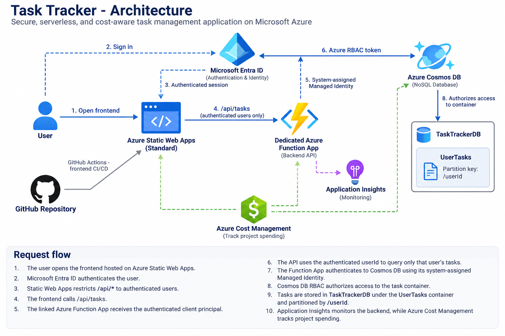
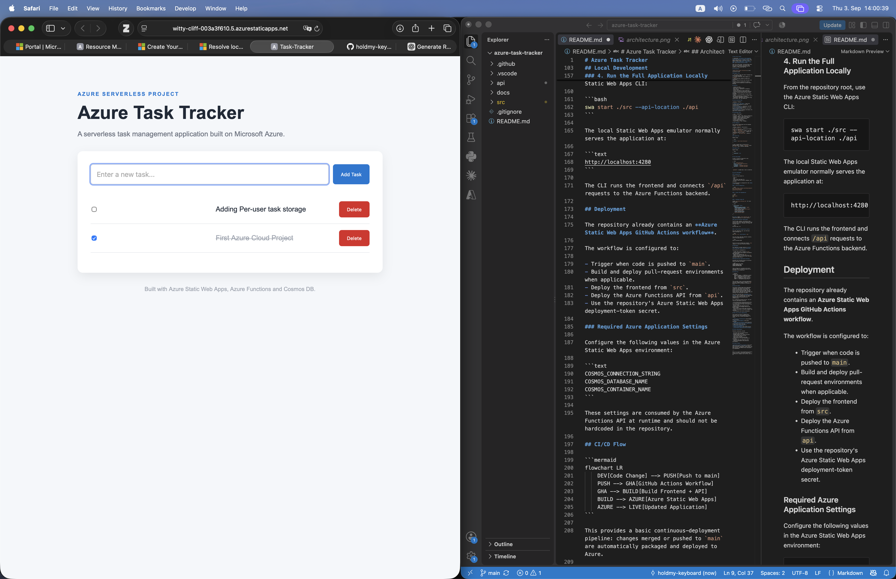
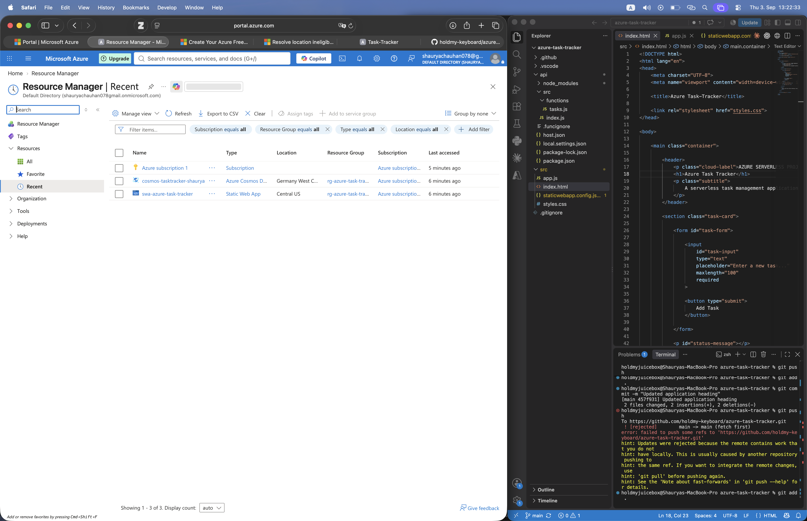
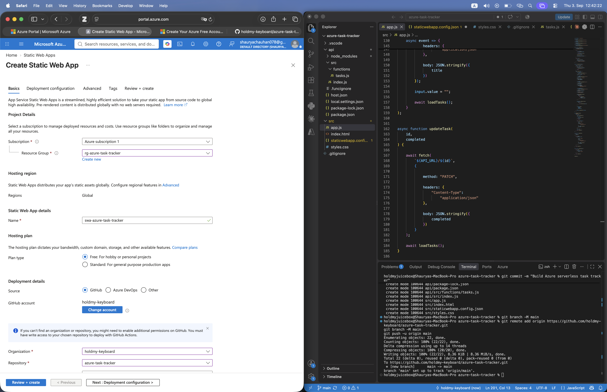
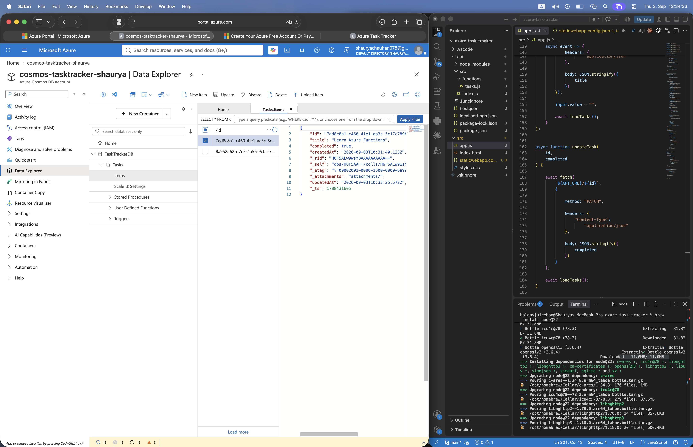
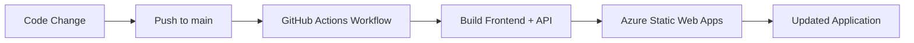

# Azure Task Tracker

A lightweight **serverless task management application built on Microsoft Azure**. The project demonstrates a complete cloud-native CRUD workflow using **Azure Static Web Apps**, **Azure Functions**, **Azure Cosmos DB**, and **GitHub Actions CI/CD**.

Users can create tasks, view persisted tasks, mark tasks as complete, and delete them through a simple browser-based interface backed by a serverless REST API.

## Architecture



### Request Flow

1. The browser loads the static frontend from Azure Static Web Apps.
2. Frontend JavaScript sends requests to `/api/tasks`.
3. Azure Functions handles the REST API operations.
4. Azure Cosmos DB stores and retrieves task data.
5. GitHub Actions automatically deploys changes from the repository to Azure Static Web Apps.

## Features

- Create new tasks.
- Retrieve all stored tasks.
- Mark tasks as completed or incomplete.
- Delete tasks.
- Persist task data in Azure Cosmos DB.
- Serverless HTTP API using Azure Functions.
- Static frontend hosted with Azure Static Web Apps.
- Automatic CI/CD deployment through GitHub Actions.
- Runtime configuration stored outside source code through environment variables.
- Responsive, dependency-free frontend using vanilla HTML, CSS, and JavaScript.

## Screenshots

### 1. Live Application

The deployed Azure Task Tracker running through Azure Static Web Apps.
The frontend communicates with the Azure Functions API to create, update, retrieve, and delete tasks.



---

### 2. Azure Resources

The Azure resources used by the project, including Azure Static Web Apps and Azure Cosmos DB, deployed within the project's Azure resource group.



---

### 3. Azure Static Web App Deployment

Azure Static Web Apps configured with the GitHub repository as the deployment source. Changes pushed to the `main` branch are deployed through the generated GitHub Actions workflow.



---

### 4. Cosmos DB Task Storage

Task data persisted in Azure Cosmos DB. The Azure Portal Data Explorer shows task documents created through the application's Azure Functions API.



## Azure Services Used

| Service | Purpose |
|---|---|
| **Azure Static Web Apps** | Hosts the frontend and integrates it with the serverless API. |
| **Azure Functions** | Implements the REST API for task CRUD operations. |
| **Azure Cosmos DB** | Provides persistent NoSQL storage for tasks. |
| **GitHub Actions** | Builds and deploys the application automatically. |

## Technology Stack

| Layer | Technology |
|---|---|
| Frontend | HTML5, CSS3, Vanilla JavaScript |
| Backend | Node.js, Azure Functions v4 |
| Database | Azure Cosmos DB for NoSQL |
| Hosting | Azure Static Web Apps |
| CI/CD | GitHub Actions |
| API Runtime | Node.js 22 |
| Source Control | Git / GitHub |

## API Endpoints

The frontend communicates with the backend through `/api/tasks`.

| Method | Endpoint | Description |
|---|---|---|
| `GET` | `/api/tasks` | Retrieve the authenticated user's tasks, ordered by creation time. |
| `POST` | `/api/tasks` | Create a new task. |
| `PATCH` | `/api/tasks/{id}` | Update the completion state of a task. |
| `DELETE` | `/api/tasks/{id}` | Delete a task. |

### Create Task

Request body:

```json
{
  "title": "Learn Azure Functions"
}
```

A newly created task is stored with the authenticated user's `userID`, a generated UUID, a default `completed` value of `false`, and a creation timestamp.

### Update Task

Request body:

```json
{
  "completed": true
}
```

## Task Data Model

A task is stored in Cosmos DB in the following general format:

```json
{
  "id": "generated-uuid",
  "userID": "static-web-apps-user-id",
  "title": "Learn Azure Functions",
  "completed": false,
  "createdAt": "ISO-8601-timestamp",
  "updatedAt": "ISO-8601-timestamp"
}
```

`userID` is the authenticated Azure Static Web Apps user identifier and the Cosmos DB partition-key value. `updatedAt` is added when a task is modified.


## Local Development

### Prerequisites

Install or have access to:

- Node.js.
- npm.
- Azure Static Web Apps CLI.
- An Azure Cosmos DB account, database, and container.

The deployed API is configured for the **Node.js 22** runtime.

### 1. Clone the Repository

```bash
git clone https://github.com/holdmy-keyboard/azure-task-tracker.git
cd azure-task-tracker
```

### 2. Install API Dependencies

```bash
cd api
npm install
cd ..
```

### 3. Configure Cosmos DB

Create `api/local.settings.json` for local development:

```json
{
  "IsEncrypted": false,
  "Values": {
    "FUNCTIONS_WORKER_RUNTIME": "node",
    "COSMOS_CONNECTION_STRING": "<your-cosmos-db-connection-string>",
    "COSMOS_DATABASE_NAME": "<your-database-name>",
    "COSMOS_CONTAINER_NAME": "<your-container-name>"
  }
}
```

Do **not** commit `local.settings.json` or Cosmos DB credentials to source control.

### Cosmos DB Container Requirement

The API stores every task in its authenticated user's logical partition. The partition-key path is case-sensitive and must match the `userID` document property exactly:

```text
Partition key: /userID
```

The application validates this path when connecting to Cosmos DB and fails fast if its spelling or capitalization differs.

If an older version wrote lowercase `userId` properties into this container, stop all task writes for the duration of the migration. Then preview and run the included case migration from the `api` directory:

```bash
npm run migrate:user-id-case
npm run migrate:user-id-case -- --apply --confirm-writes-disabled
npm run migrate:user-id-case
```

The apply step creates and verifies correctly partitioned copies before conditionally removing legacy items. Resume application writes only after the final dry run reports zero legacy tasks.

### 4. Run the Full Application Locally

From the repository root, use the Azure Static Web Apps CLI:

```bash
swa start ./src --api-location ./api
```

The local Static Web Apps emulator normally serves the application at:

```text
http://localhost:4280
```

The CLI runs the frontend and connects `/api` requests to the Azure Functions backend.

## Deployment

The repository already contains an **Azure Static Web Apps GitHub Actions workflow**.

The workflow is configured to:

- Trigger when code is pushed to `main`.
- Build and deploy pull-request environments when applicable.
- Deploy the frontend from `src`.
- Deploy the Azure Functions API from `api`.
- Use the repository's Azure Static Web Apps deployment-token secret.

### Required Azure Application Settings

Configure the following values in the Azure Static Web Apps environment:

```text
COSMOS_CONNECTION_STRING
COSMOS_DATABASE_NAME
COSMOS_CONTAINER_NAME
```

These settings are consumed by the Azure Functions API at runtime and should not be hardcoded in the repository.

## CI/CD Flow



This provides a basic continuous-deployment pipeline: changes merged or pushed to `main` are automatically packaged and deployed to Azure.

## Security Notes

The project already keeps Azure deployment credentials and Cosmos DB configuration outside the application source code. The GitHub Actions workflow consumes the Azure Static Web Apps deployment token through GitHub Secrets, while the API reads Cosmos DB settings from environment variables.

The current task API uses **anonymous HTTP access**. This is appropriate for the present portfolio/demo scope but means the CRUD endpoints are not protected by user authentication.

For a production-oriented version, the next security improvements would be:

- Add authentication through Microsoft Entra ID / Azure Static Web Apps authentication.
- Add authorization so users can access only their own tasks.
- Replace Cosmos DB connection-string authentication with Managed Identity and Cosmos DB RBAC.
- Add stricter server-side input validation.
- Add API monitoring, structured logging, and alerting.
- Add automated tests before deployment.

## What This Project Demonstrates

This project was built to demonstrate practical Azure cloud engineering skills rather than only frontend development. It covers:

- **Serverless architecture** using managed Azure services.
- **REST API development** with Azure Functions.
- **NoSQL data persistence** with Cosmos DB.
- **Frontend-to-serverless API integration** through Azure Static Web Apps.
- **Environment-based secret and configuration management**.
- **CI/CD automation** with GitHub Actions.
- **Cloud-native CRUD application design**.

## Future Improvements

Potential extensions include:

- Microsoft Entra ID authentication.
- Per-user task isolation.
- Managed Identity for Cosmos DB access.
- Task due dates and priorities.
- Search and filtering.
- Application Insights monitoring.
- Infrastructure as Code using Bicep or Terraform.
- Automated API and integration tests.
- Separate development and production environments.

## Project Status

**Functional portfolio project** — core task CRUD functionality, Cosmos DB persistence, Azure Functions integration, Azure Static Web Apps hosting, and GitHub Actions deployment are implemented.

---

Built as an Azure cloud engineering portfolio project focused on serverless application architecture, managed cloud services, and CI/CD.
