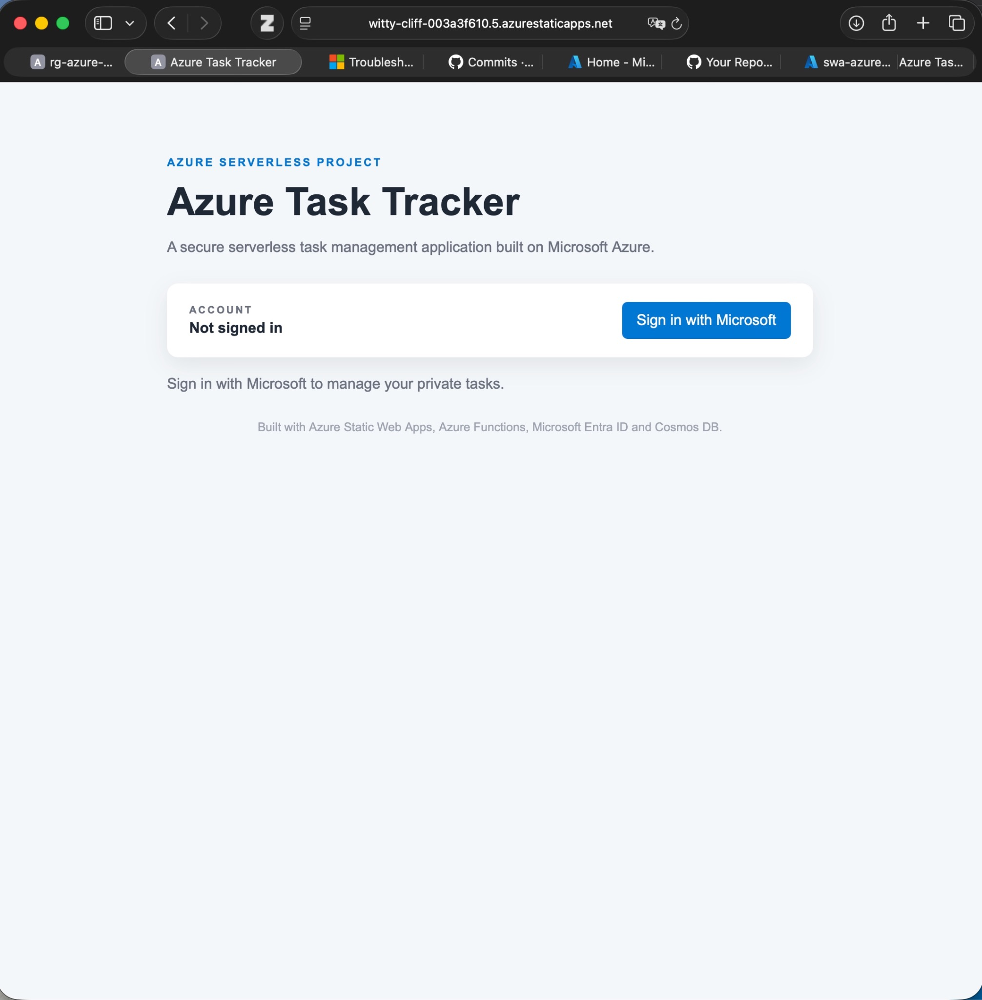
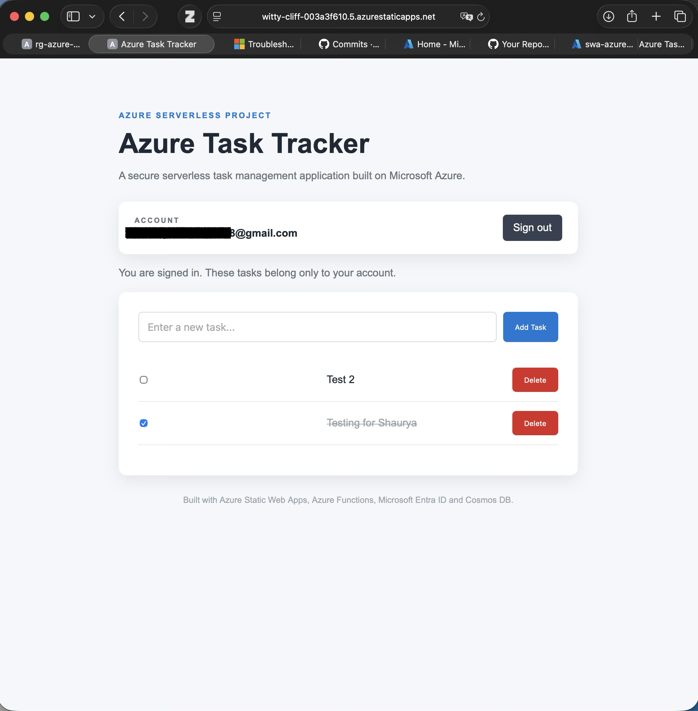
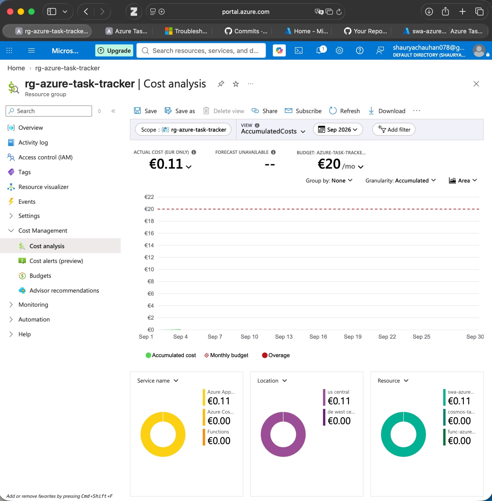

# Azure Task Tracker

A secure, serverless task management application built on Microsoft Azure.

The project started as a simple Azure CRUD application and was extended with **Microsoft Entra ID authentication**, **user-specific task isolation**, a **dedicated Azure Function App**, **Managed Identity**, **Azure RBAC**, **passwordless Cosmos DB access**, **Application Insights**, **GitHub Actions CI/CD**, and **Azure Cost Management**.

> **Live application:** https://witty-cliff-003a3f610.5.azurestaticapps.net

---

## Features

- Create tasks
- View saved tasks
- Mark tasks as complete or incomplete
- Delete tasks
- Persist task data in Azure Cosmos DB
- Sign in and sign out with a Microsoft account
- Restrict the API to authenticated users
- Keep each user's tasks private and isolated
- Store tasks using `/userId` as the Cosmos DB partition key
- Run the REST API in a dedicated Azure Function App
- Use a system-assigned Managed Identity for the Function App
- Access Cosmos DB without storing account keys or production connection strings
- Authorize Cosmos DB access with Azure RBAC
- Automatically deploy frontend changes with GitHub Actions
- Monitor the application with Application Insights
- Track project spending with Azure Cost Management and budget alerts

---

## Architecture


---

## Azure Services and Technologies

| Service / Technology | Purpose |
|---|---|
| **Azure Static Web Apps - Standard** | Hosts the frontend and proxies authenticated `/api/*` requests |
| **Microsoft Entra ID** | Authenticates users and Azure workloads |
| **Azure Functions** | Runs the serverless REST API in a dedicated Function App |
| **Azure Cosmos DB for NoSQL** | Stores user-specific task documents |
| **Managed Identity** | Provides passwordless workload authentication for the Function App |
| **Azure RBAC** | Authorizes the Function App to access Cosmos DB data |
| **Application Insights** | Provides application monitoring and telemetry |
| **Azure Cost Management** | Tracks project cost and budget usage |
| **Azure Storage Account** | Supports the dedicated Azure Function App |
| **GitHub Actions** | Automatically deploys frontend changes |
| **JavaScript / Node.js 22** | Frontend and backend application runtime |
| **HTML / CSS** | User interface |
| **VS Code** | Local development environment |
| **Azure CLI** | Azure authentication and administrative tasks |
| **Azure Functions Core Tools** | Local Azure Functions development |
| **Azure Static Web Apps CLI** | Local Static Web Apps and authentication emulation |

---

## Project Structure

```text
azure-task-tracker/
│
├── .github/
│   └── workflows/
│       └── azure-static-web-apps-witty-cliff-003a3f610.yml
│
├── api/
│   ├── src/
│   │   ├── functions/
│   │   │   └── tasks.js
│   │   └── index.js
│   ├── host.json
│   ├── package.json
│   └── package-lock.json
│
├── docs/
│
├── screenshots/
│   ├── microsoft-sign-in.png
│   ├── authenticated-task-tracker.png
│   └── cost-management-budget.png
│
├── src/
│   ├── app.js
│   ├── index.html
│   ├── staticwebapp.config.json
│   └── styles.css
│
├── .gitignore
└── README.md
```

`api/local.settings.json` is intentionally excluded from Git.

---

## Application Functionality

The Task Tracker exposes four API operations.

| Method | Endpoint | Purpose |
|---|---|---|
| `GET` | `/api/tasks` | Retrieve the authenticated user's tasks |
| `POST` | `/api/tasks` | Create a new task |
| `PATCH` | `/api/tasks/{id}` | Update a task's completion state |
| `DELETE` | `/api/tasks/{id}` | Delete a task |

All `/api/*` routes require an authenticated user.

---

## Microsoft Entra ID Authentication

Authentication is handled through Azure Static Web Apps.

The login route is:

```text
/.auth/login/aad
```

The frontend checks the current authenticated identity using:

```text
/.auth/me
```

After sign-in, Azure Static Web Apps provides a client principal containing information such as the authenticated `userId`.

The application uses this identity to determine which tasks the user is allowed to access.

### Route protection

`src/staticwebapp.config.json` protects the API:

```json
{
  "routes": [
    {
      "route": "/api/*",
      "allowedRoles": [
        "authenticated"
      ]
    }
  ],
  "platform": {
    "apiRuntime": "node:22"
  }
}
```

This means unauthenticated visitors can load the website, but they cannot use the task API.

---

## User Data Isolation

The original version of the project used one shared task collection. The application was upgraded so that each authenticated user has private task data.

### Cosmos DB configuration

```text
Database:      TaskTrackerDB
Container:     UserTasks
Partition key: /userId
```

A task document follows this structure:

```json
{
  "id": "task-uuid",
  "userId": "authenticated-user-id",
  "title": "Learn Azure Managed Identity",
  "completed": false,
  "createdAt": "2026-09-04T12:00:00.000Z"
}
```

The API queries tasks using the authenticated user's `userId`.

As a result:

```text
User A
  └── User A tasks

User B
  └── User B tasks
```

The browser never supplies the authoritative owner ID for a task. The backend derives it from the authenticated client principal.

---

## Passwordless Cosmos DB Authentication

The production API does **not** use a Cosmos DB account key or production connection string.

The dedicated Azure Function App has a **system-assigned Managed Identity**.

```text
Azure Function App
        ↓
Managed Identity
        ↓
Microsoft Entra ID
        ↓
Azure RBAC
        ↓
Azure Cosmos DB
```

The backend uses:

```javascript
const { DefaultAzureCredential } = require("@azure/identity");

const credential = new DefaultAzureCredential();

const client = new CosmosClient({
    endpoint,
    aadCredentials: credential
});
```

`DefaultAzureCredential` allows the same application code to use:

- **Managed Identity** when running in Azure
- the developer's **Azure CLI identity** during local development

### Cosmos DB RBAC

The Function App is assigned the:

```text
Cosmos DB Built-in Data Contributor
```

role for the task-data scope.

This provides the API with the permissions required to create, query, update, and delete task documents without giving it a Cosmos DB account key.

### Key-based authentication disabled

After Managed Identity access was verified, Cosmos DB local/key authentication was disabled:

```text
disableLocalAuth = true
```

This prevents old Cosmos DB account keys or connection strings from being used for data access.

---

## Environment Configuration

The production Function App uses non-secret configuration values:

| Variable | Purpose |
|---|---|
| `COSMOS_ENDPOINT` | Cosmos DB account endpoint |
| `COSMOS_DATABASE_NAME` | `TaskTrackerDB` |
| `COSMOS_CONTAINER_NAME` | `UserTasks` |

Production does **not** require:

```text
COSMOS_CONNECTION_STRING
COSMOS_KEY
COSMOS_PASSWORD
```

The Function App authenticates using its Managed Identity.

---

## Local Development

### Prerequisites

Install:

- Node.js 22
- Git
- VS Code
- Azure CLI
- Azure Functions Core Tools v4
- Azure Static Web Apps CLI

### 1. Clone the repository

```bash
git clone https://github.com/holdmy-keyboard/azure-task-tracker.git
cd azure-task-tracker
```

### 2. Install API dependencies

```bash
cd api
npm install
cd ..
```

### 3. Sign in to Azure CLI

```bash
az login
```

For passwordless local Cosmos DB access, the signed-in developer account must have an appropriate Cosmos DB data-plane RBAC assignment.

### 4. Configure local settings

Create `api/local.settings.json`:

```json
{
  "IsEncrypted": false,
  "Values": {
    "AzureWebJobsStorage": "",
    "FUNCTIONS_WORKER_RUNTIME": "node",
    "COSMOS_ENDPOINT": "https://YOUR-COSMOS-ACCOUNT.documents.azure.com:443/",
    "COSMOS_DATABASE_NAME": "TaskTrackerDB",
    "COSMOS_CONTAINER_NAME": "UserTasks"
  }
}
```

Do not commit this file.

### 5. Start the application

From the repository root:

```bash
swa start src --api-location api
```

Open:

```text
http://localhost:4280
```

The Static Web Apps CLI provides a local authentication emulator for development.

---

## Deployment and CI/CD

### Frontend

The frontend is deployed to Azure Static Web Apps using **GitHub Actions**.

The deployment workflow uses:

```yaml
app_location: "src"
api_location: ""
output_location: ""
```

The empty `api_location` is intentional.

The API was moved out of the managed Static Web Apps backend and into a **dedicated Azure Function App**.

The workflow is therefore responsible for the frontend deployment, while Static Web Apps forwards `/api/*` requests to the linked Function App.

### Backend

The API is deployed separately to:

```text
Dedicated Azure Function App
```

The Function App is linked to the production Static Web App as its API backend.

The backend then uses:

```text
Managed Identity
    ↓
Microsoft Entra ID
    ↓
Azure RBAC
    ↓
Cosmos DB
```

instead of a Cosmos DB connection string.

---


## Cost Management

All project resources are grouped under:

```text
rg-azure-task-tracker
```

Azure Cost Management is configured at this resource-group scope so project spending can be monitored separately.

### Budget

```text
Monthly budget: €20
```

Budget notifications are configured for:

| Alert | Threshold |
|---|---:|
| Actual cost | 50% |
| Actual cost | 75% |
| Actual cost | 90% |
| Actual cost | 100% |
| Forecasted cost | 100% |

Azure Cost Analysis is also used to review spending by service and individual resource.

> Azure budgets provide monitoring and notifications. Reaching the budget threshold does not automatically stop Azure resources.

---

## Screenshots

### Microsoft authentication

Unauthenticated users must sign in with Microsoft before accessing their private task data.



### Authenticated Task Tracker

After authentication, a user can create, complete, and delete tasks. The displayed tasks belong only to the signed-in account.



### Azure Cost Management

The project Resource Group is monitored with Azure Cost Management and a €20 monthly budget.



---

## Security Design

The application uses separate identity controls for **users** and **Azure workloads**.

### User identity

```text
User
 ↓
Microsoft Entra ID
 ↓
Azure Static Web Apps
 ↓
Authenticated role
 ↓
Azure Function API
```

This establishes who is using the application.

### Workload identity

```text
Azure Function App
 ↓
System-assigned Managed Identity
 ↓
Microsoft Entra ID
 ↓
Cosmos DB RBAC
 ↓
UserTasks
```

This establishes which Azure workload is allowed to access the database.

### Security controls implemented

- Microsoft Entra ID user authentication
- Authenticated-only API routes
- User-specific task ownership
- `/userId` Cosmos DB partitioning
- Server-side user identity enforcement
- System-assigned Managed Identity
- Passwordless Cosmos DB authentication
- Cosmos DB data-plane RBAC
- Least-privilege authorization scope
- Cosmos DB local/key authentication disabled
- Sensitive local settings excluded with `.gitignore`

---

## Current Security and Cloud Architecture Summary

| Area | Implementation |
|---|---|
| Frontend hosting | Azure Static Web Apps - Standard |
| User authentication | Microsoft Entra ID |
| API authorization | Static Web Apps `authenticated` role |
| Backend | Dedicated Azure Function App |
| Database | Azure Cosmos DB for NoSQL |
| User isolation | `/userId` partitioning |
| Workload identity | System-assigned Managed Identity |
| Database authorization | Cosmos DB RBAC |
| Database credentials | Passwordless - no production Cosmos DB key |
| Monitoring | Application Insights |
| CI/CD | GitHub Actions |
| Cost governance | Azure Cost Management + €20 monthly budget |

